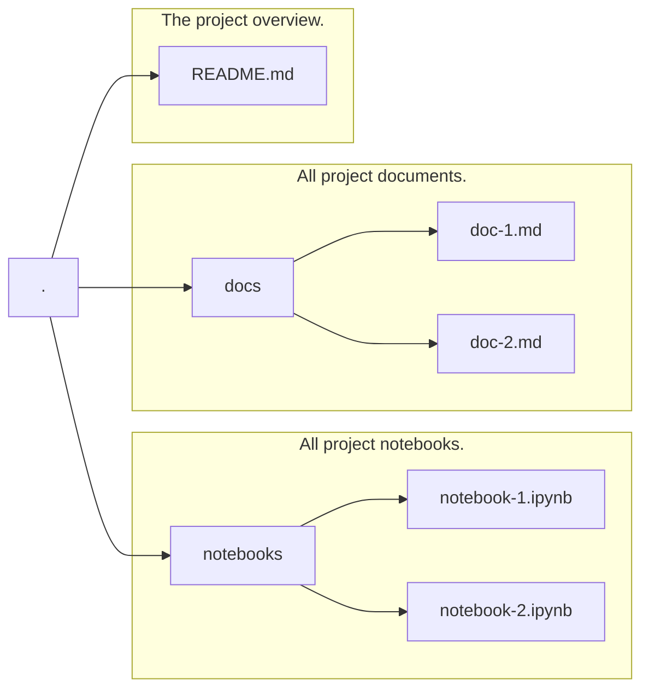

# Excel Python utilities

This repository is based on a default Python project template.  The various resources are described below as well as actions that should be completed once the project is created.

- Setup configuration files to determine details for reading data from an Excel worksheet.  See excel.conf
- Create function that can generate a Markdown file
- Create function to generate JSON file
- Create function to generate Excel output file
- Create function to read JSON file.

* [X]  Update setup.py
* [X]  Rename main python directory (from sample to excel_workbook)
* [ ]  Create cacher snippet/document for working with python argparser
* [ ]  Create cacher snippet/document for working with python logging
* [ ]  Create cacher snippet/document for working with python configurations
* [ ]  Add docstrings and create documentation automatically
* [ ]  Include a diagram that shows how these objects relate, etc.
* [ ]  Add utilities, etc. to create Documentation (Sphinx, etc.)
* [ ]  Add decorators to classes.
* [ ]  Add sphinx modules/etc. and run batch file to update docs/ folder
* [ ]  Review Python Documentation repository and add general directions to this readme for generating/updating code documentation.  This can be done once excel related python code has been added.

## docs/

Contains files that create and manage documentation for the project.  These resources can utilize tools that automatically generate documentation based on following standards.  E.g. When using google doc strings in Python files, sphinx can be used to automatically create documentation that pulls code comments to create code documentation.  Setup of Sphinx, etc. has to be done in order to generate documentation.

## conf/

Contains configuration files used by application.

## excel_workbook/

This is the main code directory where the main python project code resides.  This folder is really just for reference and should be removed and/or renamed based on this projects purpose.

### excel_workbook.py - Class excel_workbook

This is the main Excel Workbook class object.

#### Attributes

* workbook_filename (str): The full filename path to the Excel workbook
* worksheets (int): A dictionary containing the Excel worksheets in the Excel workbook
* defined_names (str): An array of the defined names in the Excel workbook

## excel_files/

Excel files used for testing and as input and output files.

## tests/

This contains files/resources for running automated tests (unit, integration, etc.).  It could be left alone initially until real testing requirements have been figured out.

* [ ]  Create a simple unit test that references actual project code.  Doing this as early as possible makes it easier to just expand these automated tests at a later time.

Makefile - The Makefile will install any required modules (e.g. Sphinx tools, etc.)
setup.py - This file is a basic python file for creating a module/library ?!?
requirements.txt - This file will include all the python modules used/needed for this project.

* [X]  Update setup.py with actual project information.

mermaid code

| Object          | Description                                                     | Notes |
| --------------- | --------------------------------------------------------------- | ----- |
| excel_models    | Contains main ExcelWorkbook class definition                    |       |
| excel_utilities | Contains various utilities for working with Excel spreadsheets. |       |
